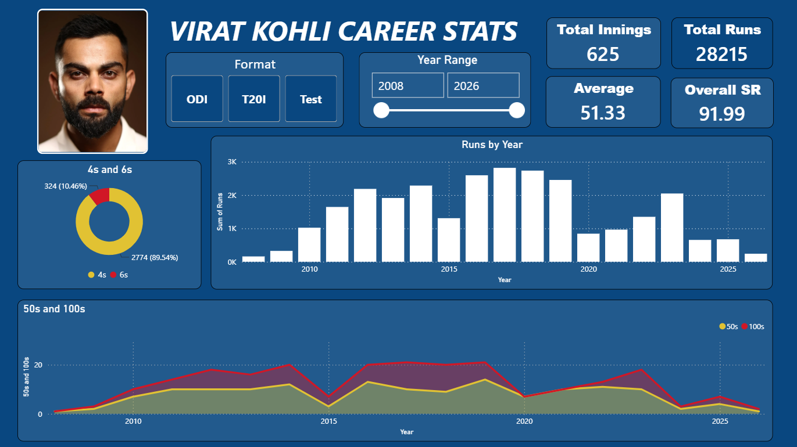
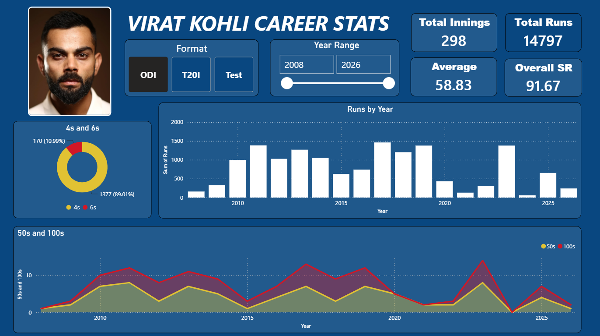
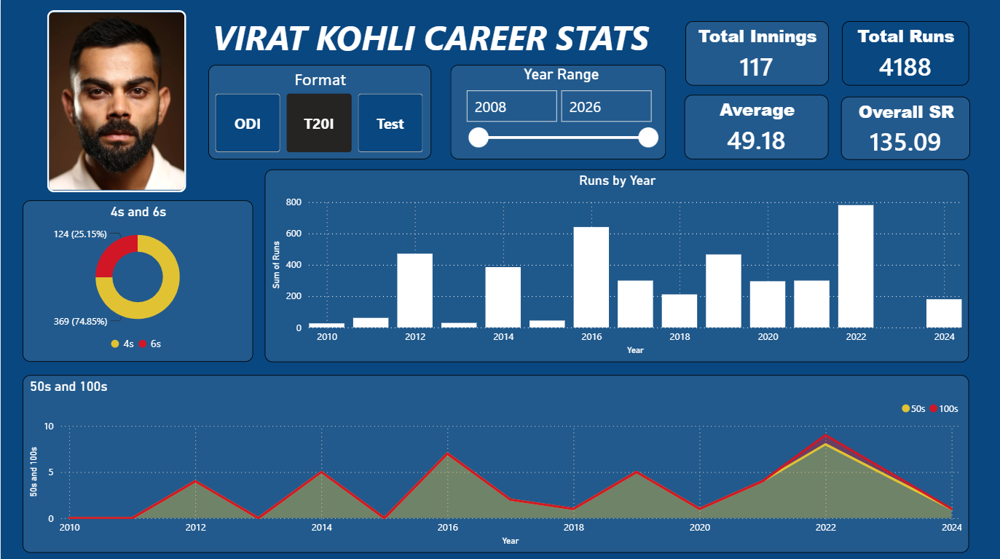
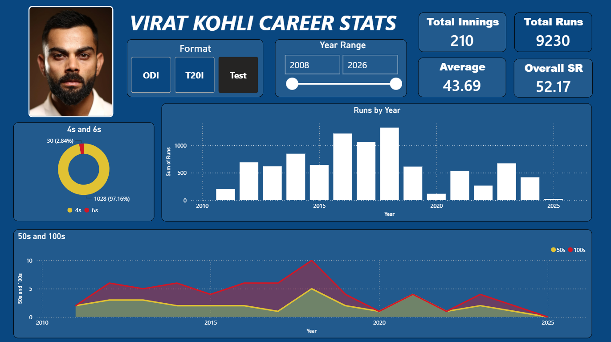
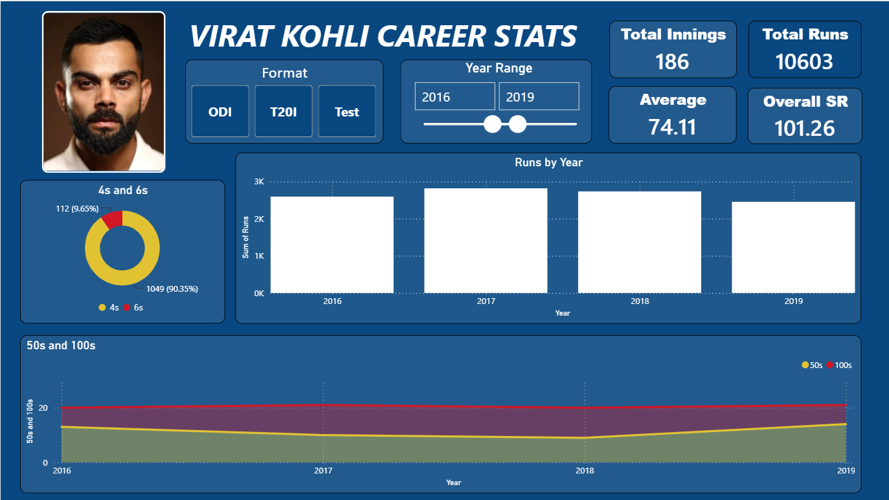

# 🏏 Virat Kohli Career Stats — Power BI Dashboard


An interactive, end-to-end **Microsoft Power BI Dashboard** designed to analyze and visualize the prolific international cricket career of **Virat Kohli**. This comprehensive analytics tool covers all international formats (**ODI**, **T20I**, and **Test**) spanning from **2008 to 2026**, offering granular insights into runs scored, batting averages, strike rates, century conversions, and boundary breakdowns.

---

## 🌟 Dashboard Overview

The **Virat Kohli Career Stats Dashboard** empowers cricket enthusiasts, analysts, and data scientists to interactively explore batting performances across different eras and formats. Through dynamic slicers and intuitive visualizations, users can dissect year-on-year consistency, peak golden periods, and format-specific dominance.

### 🔥 Key Features & Interactivity
* **Dynamic Format Slicer**: Instantly toggle between **ODI**, **T20I**, **Test**, or **Overall Career Stats** with a single click.
* **Interactive Year Range Filter**: A dual-ended slider enabling custom date range filtering (`2008` to `2026`). Isolate specific phases, such as his legendary peak era from `2016–2019`.
* **Real-Time KPI Summary Cards**: High-level metrics tracking **Total Innings**, **Total Runs**, **Batting Average**, and **Overall Strike Rate (SR)** that dynamically update based on user filters.
* **Deep-Dive Visualizations**:
  * **Boundary Distribution (Donut Chart)**: Percentage breakdown of total `4s` vs. `6s` hit.
  * **Runs by Year (Column Bar Chart)**: Annual run aggregation across calendar years showing trajectory and milestones.
  * **Milestone Trend (Area / Line Chart)**: Year-over-year progression and conversion of Half-Centuries (**50s**) and Centuries (**100s**).

---

## 📊 Career Summary Breakdown

| Format | Total Innings | Total Runs | Batting Average | Strike Rate (SR) | Key Highlights |
| :--- | :---: | :---: | :---: | :---: | :--- |
| **Overall (All Formats)** | **625** | **28,215** | **51.33** | **91.99** | **2,774** Fours & **324** Sixes hit across all formats |
| **ODI (One Day Internationals)** | **298** | **14,797** | **58.83** | **91.67** | Highest run-scoring format with exceptional consistency |
| **T20I (Twenty20 Internationals)**| **117** | **4,188** | **49.18** | **135.09** | Elite strike rate (`135.09`) combined with high average (`49.18`) |
| **Test Cricket** | **210** | **9,230** | **43.69** | **52.17** | Long-format endurance across 210 innings |
| *(Special View)* **Peak Era (2016–2019)** | **186** | **10,603** | **74.11** | **101.26** | **Golden Run**: Scored over 10K runs at a staggering **74.11 average** |

---

## 📸 Dashboard Preview & Slicer Views

### 1. Overall Career Stats (All Formats Combined)
Displays aggregate career statistics spanning `2008–2026`, showcasing **28,215 total runs** across **625 innings** at a **51.33 average**.


---

### 2. ODI (One Day Internationals) View
Selecting the **ODI** slicer isolates Virat Kohli's 50-over mastery: **14,797 runs** in **298 innings** at an extraordinary **58.83 average**.


---

### 3. T20I (Twenty20 Internationals) View
Showcasing his impact in the shortest international format: **4,188 runs** across **117 innings** with a high-octane **135.09 strike rate**.


---

### 4. Test Cricket View
Illustrates his journey in red-ball cricket: **9,230 runs** across **210 innings** with numerous memorable centuries.


---

### 5. Year Range Slicer — Peak Era Analysis (`2016–2019`)
Using the custom **Year Range Slicer** (`2016 to 2019`), the dashboard highlights Virat Kohli's undisputed prime: **10,603 runs** across **186 innings** averaging **74.11** with a strike rate of **101.26**.


---

## 🛠️ Visualizations & KPIs Explained

1. **Top Banner KPIs**:
   * **Total Innings**: Count of international innings batted within the active filter scope.
   * **Total Runs**: Cumulative runs scored across selected formats and years.
   * **Average**: Formula-driven DAX measure calculating `Total Runs / Dismissals`.
   * **Overall SR**: Batting Strike Rate (`(Total Runs / Balls Faced) * 100`).

2. **4s and 6s (Donut Chart)**:
   * Visualizes the proportion of boundary runs. Noticeably, Kohli relies heavily on precision ground strokes (`4s` account for ~89–90% of his boundaries across formats).

3. **Runs by Year (Bar Chart)**:
   * Provides immediate visual identification of high-scoring calendar years (such as `2016`, `2017`, and `2018`, where annual run tallies regularly exceeded `2,500+` runs).

4. **50s and 100s (Area/Line Chart)**:
   * Tracks half-centuries (yellow area) vs. centuries (red line) year by year, illustrating his milestone conversion rate across different career phases.

---

## 🚀 Getting Started

### Prerequisites
* **Microsoft Power BI Desktop** (Free to download from the [Microsoft Store](https://apps.microsoft.com/detail/9ntrpe6lq5sl) or [Power BI Official Website](https://powerbi.microsoft.com/desktop/)).

### Running the Dashboard Locally
1. **Clone or Download the Repository**:
   ```bash
   git clone https://github.com/pururajsingh06/ViratKohli_PowerBI_Dashboard.git
   ```
2. **Open the Power BI Project**:
   * Navigate to the project directory and double-click `Virat Kohli Dashboard.pbix`.
3. **Explore & Interact**:
   * Use the **Format** buttons (`ODI`, `T20I`, `Test`) on the top-left to filter metrics.
   * Adjust the **Year Range** slider (`2008–2026`) on the top-center to analyze custom time horizons.
   * Hover over individual bars and chart points for detailed tooltips.

---

## 📁 Repository Structure

```text
ViratKohli_PowerBI_Dashboard/
│
├── Virat Kohli Dashboard.pbix   # Main Power BI Desktop Dashboard File
├── README.md                    # Project Documentation (This File)
├── SS1.png                      # Screenshot: Overall Career Stats
├── SS2.png                      # Screenshot: ODI Format View
├── SS3.png                      # Screenshot: T20I Format View
├── SS4.png                      # Screenshot: Test Format View
└── SS5.png                      # Screenshot: Peak Era Slicer View (2016-2019)
```

---

## 🤝 Contributing & Feedback
Contributions, issues, and feature requests are welcome! Feel free to open an issue or submit a pull request if you have ideas for additional measures, visual improvements, or updated match data.

---

## 📄 License & Credits
* **Developed by**: [Pururaj Singh](https://github.com/pururajsingh06)
* **Data Sources**: Publicly available international cricket statistics from ESPNcricinfo & ICC databases.